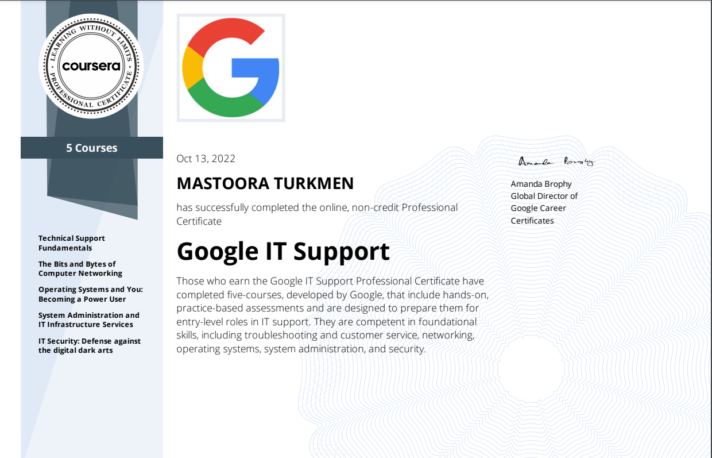
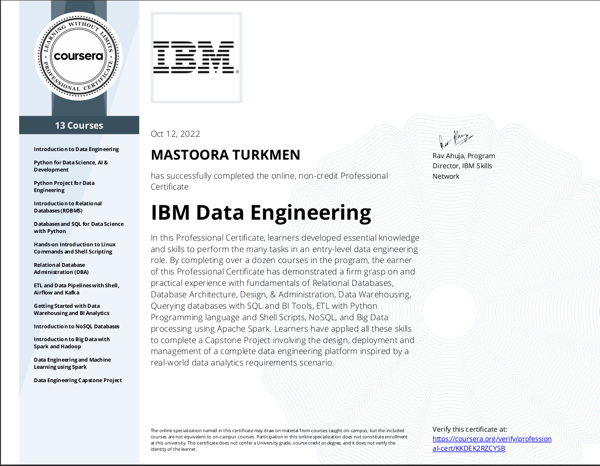
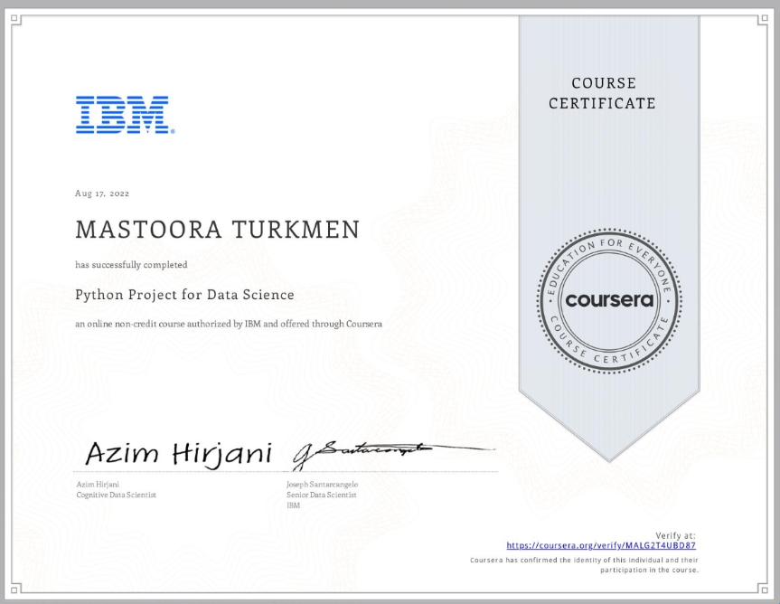
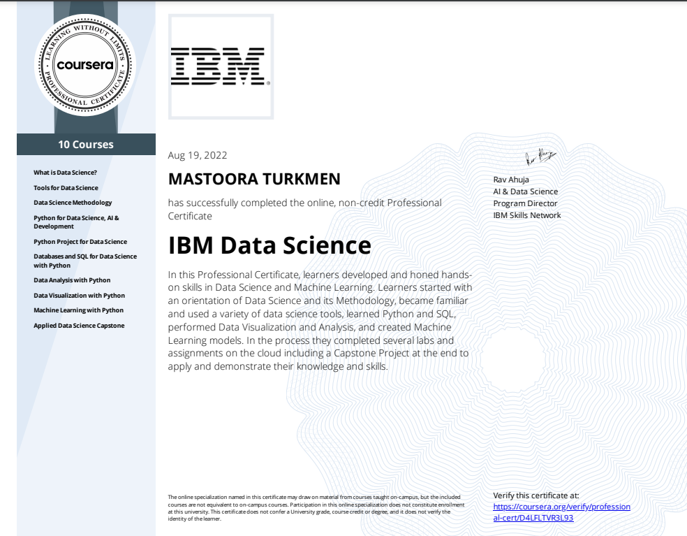
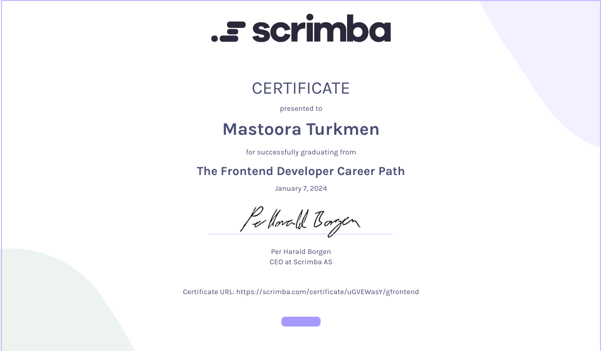
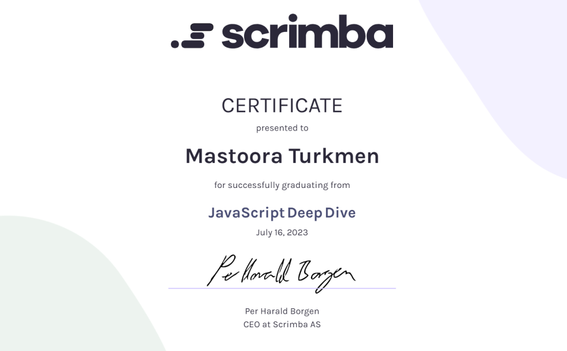
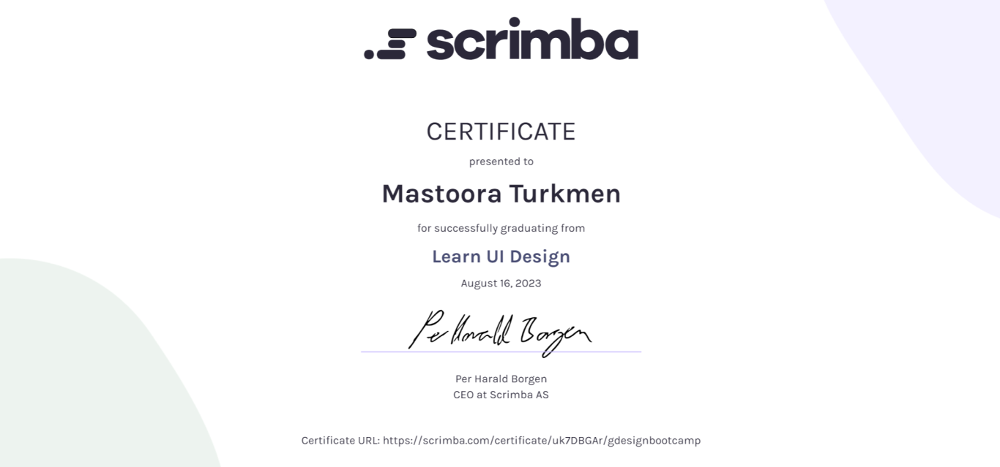
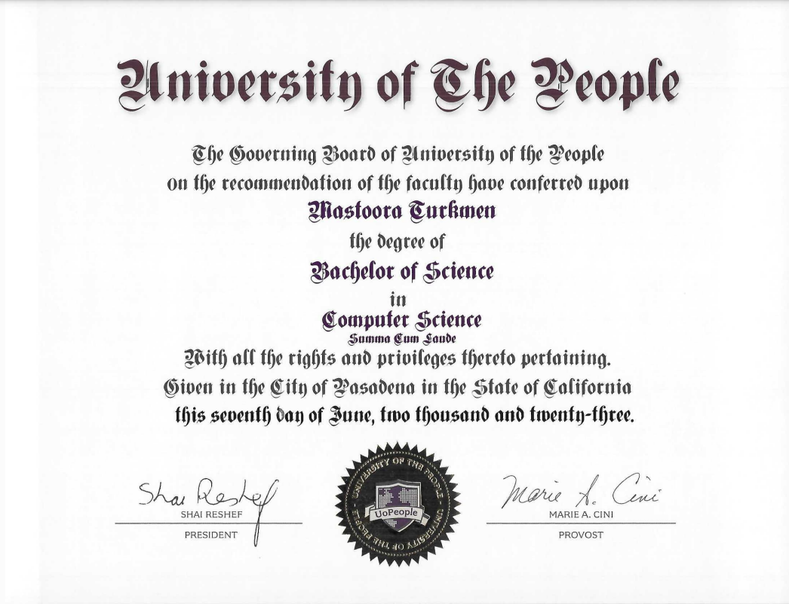

# 🏆 Certificates of Achievement

Welcome to my certifiactes section. Here I will share all of my Certificates that I have got
from Universities, Courses, and other flatporms. 
These certificates are a testament to my dedication, expertise, and continuous learning in various programming languages, frameworks, and technologies. 

1. Each certificate represents a significant milestone in my professional journey, symbolizing the    mastery and proficiency I have attained.
2. Through rigorous training and hands-on experience, I have honed my skills to deliver high-quality solutions and contribute effectively to software development projects.
3. Browse through my certificates to gain confidence in my abilities and witness my commitment to staying at the forefront of the ever-evolving tech landscape.

# Universities & Courses 🎊 🎖 📒

## ***Courses***
   1. 🎆 [Coursera](https://www.coursera.org/)
       + ***Google IT Support***
       + ***IBM***
       + ***IBM Data Engineering***
       + ***IBM Data Sceince***
       + ***Python Project for Data Science***
       
   2. 🌠 [Scrimba](https://scrimba.com/)
       + ***HTML5***
       + ***HTML***
       + ***CSS3***
       + ***CSS***
       + ***JavaScript***
       + ***React***
       + ***Python***
       + ***Svelte***
   3. 🎇 [Sololearn](https://www.sololearn.com/)
       + ***HTML5***
       + ***CSS3***
       + ***JavaScript***
       + ***React***

### ***1.Coursera Certificates of Achievement***

### ***2.Scrimba Certificates of Achievement***

## **Universities**
   + [University of The People](https://www.uopeople.edu/)

